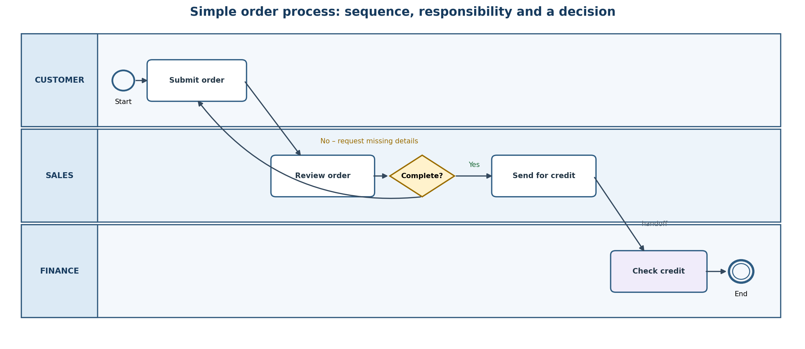
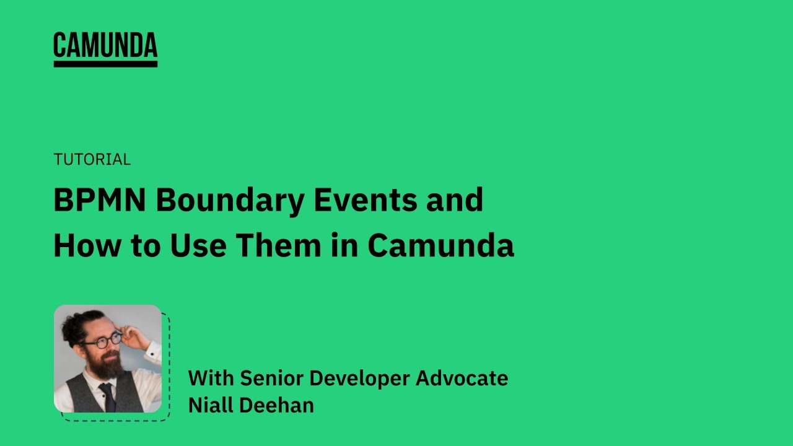
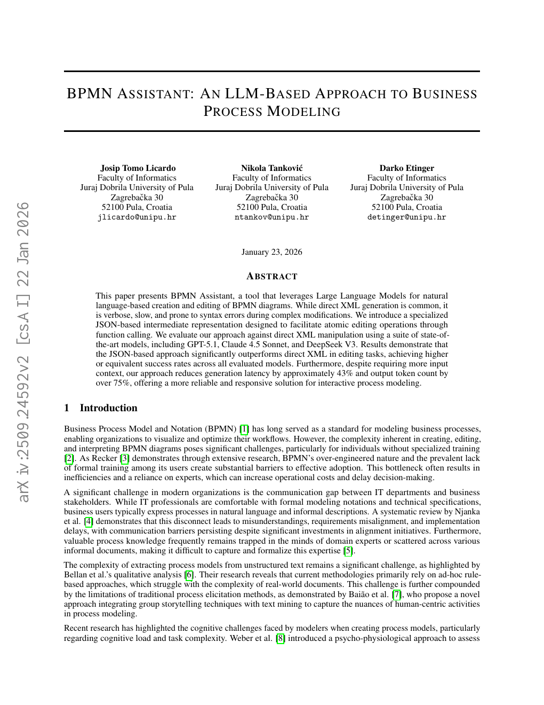
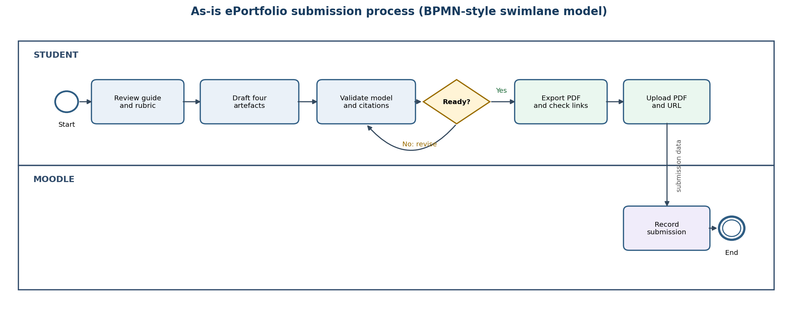

# COIT20252 – ePortfolio 2: Business Process Modelling

**Student:** Binaya Bhandari  
**Student number:** 12312847  
**Tutor:** Shakir Karim  
**Due date:** Friday, 4 September 2026

## Chosen topic and learning focus

I selected Business Process Modelling because it translates process knowledge into a shared visual language. These four artefacts move from foundational notation to exception handling, current AI-assisted modelling research and my own applied model. I also evaluate the strengths and limitations of each item, following the feedback from ePortfolio 1.

## Swim-lane notation from the Week 4 lecture

*Figure 1. Simplified swim-lane diagram based on the Week 4 lecture example (adapted from CQUniversity 2026, p. 24).*

Summary: The Week 4 slide presents a swim-lane model in which activities move from left to right while lanes identify the customer and internal participants. Events indicate the process trigger and termination. This demonstrates that a useful process model represents sequence and responsibility together, rather than listing tasks without showing handoffs (CQUniversity 2026, p. 24).

Reflection and justification: I chose this artefact because it gave me a clear bridge from a simple flowchart to BPMN-style thinking. Its strength is immediate accountability: a reader can see who acts and where work crosses a boundary. Its limitation is that one static diagram cannot show timing or workload. I would therefore validate it with participants and add performance data before redesigning the process.

## Camunda tutorial on BPMN boundary events

*Figure 2. Thumbnail for Camunda’s 2025 boundary-events tutorial (Camunda 2025).*

Summary: Camunda’s tutorial demonstrates how a boundary event is attached to an active task to represent an interruption or alternative path. The worked modelling examples show why exceptions should be visible in the process logic instead of being hidden in notes or assumed by the modeller (Camunda 2025, 00:00–34:21).

Reflection and justification: I selected the video because it extends the lecture’s basic events and gateways into practical exception modelling. I learned that the “normal” path alone can create a misleading model. The video’s visual demonstrations are a strength, but its Camunda focus may encourage tool-first thinking. In future work I would define the business exception with a subject-matter expert first, then choose the correct BPMN event and test whether stakeholders interpret it consistently.

[Watch the Camunda boundary-events tutorial](https://www.youtube.com/watch?v=t_4F8fSvAvU)

## Research on an AI-assisted BPMN modeller

*Figure 3. First page of the BPMN Assistant research paper (Licardo, Tanković & Etinger 2026, p. 1).*

Summary: Licardo, Tanković and Etinger present BPMN Assistant, which converts natural-language requests into a structured JSON representation before producing BPMN XML. Their evaluation reports stronger editing reliability, about 43% lower latency and more than 75% fewer output tokens than direct XML generation (Licardo, Tanković & Etinger 2026, pp. 1–3).

Reflection and justification: I chose this current scholarly artefact because it connects process modelling with my Information Systems studies. It shows that AI can reduce the technical barrier between domain knowledge and formal notation. However, faster generation does not prove that the business meaning is correct. I would treat an AI model as a draft, then check its scope, gateways, exceptions and responsibilities with process participants. This critical validation is more important than accepting a polished diagram automatically.

[Read the BPMN Assistant paper](https://arxiv.org/abs/2509.24592)

## My ePortfolio submission process model

*Figure 4. Original BPMN-style swim-lane model of my ePortfolio submission process (author’s own work 2026).*

Summary: I created a two-lane model of my ePortfolio submission process. It separates my activities from Moodle’s system activity and includes a “Ready?” gateway, a revision loop, submission data and a clear end event. The model turns the controls identified in my first portfolio into visible flow logic (author’s own work 2026).

Reflection and justification: This artefact provides direct evidence that I can apply modelling concepts, not only describe them. Evaluating the result showed two benefits: ownership is clearer, and the quality check occurs before upload. It also exposed a limitation: the model does not quantify rework time or late-submission risk. I would improve it by recording cycle time and revision frequency, then simulate an earlier review checkpoint. This links modelling to measurable improvement and directly addresses my previous feedback to evaluate results more explicitly.

## References

Camunda 2025, ‘Tutorial: BPMN Boundary Events and How to Use them in Camunda’, YouTube video, 30 April, viewed 3 September 2026, <https://www.youtube.com/watch?v=t_4F8fSvAvU>.

CQUniversity 2026, *COIT20252 Business Process Management: Week 4 – Business Process Modelling (Part 1)*, PowerPoint slides, CQUniversity, viewed 3 September 2026, Moodle.

Licardo, JT, Tanković, N & Etinger, D 2026, ‘BPMN Assistant: An LLM-Based Approach to Business Process Modeling’, *arXiv* preprint arXiv:2509.24592v2, viewed 3 September 2026, <https://arxiv.org/abs/2509.24592>.

## AI use statement

I used generative AI as a planning and editing assistant, not as a substitute for my own learning. It helped me organise possible artefacts, locate relevant sources, improve clarity and check the draft against the task guide and feedback from ePortfolio 1. I then reviewed the lecture slides and original sources, verified the dates and citations, created and evaluated my own process model, and refined each reflection so the final portfolio communicates my personal understanding and learning development.
