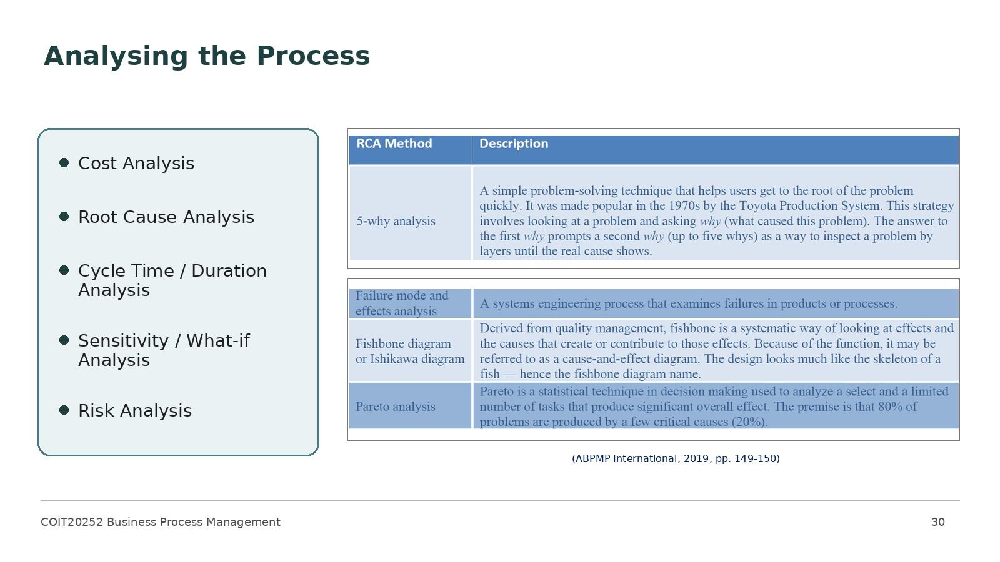
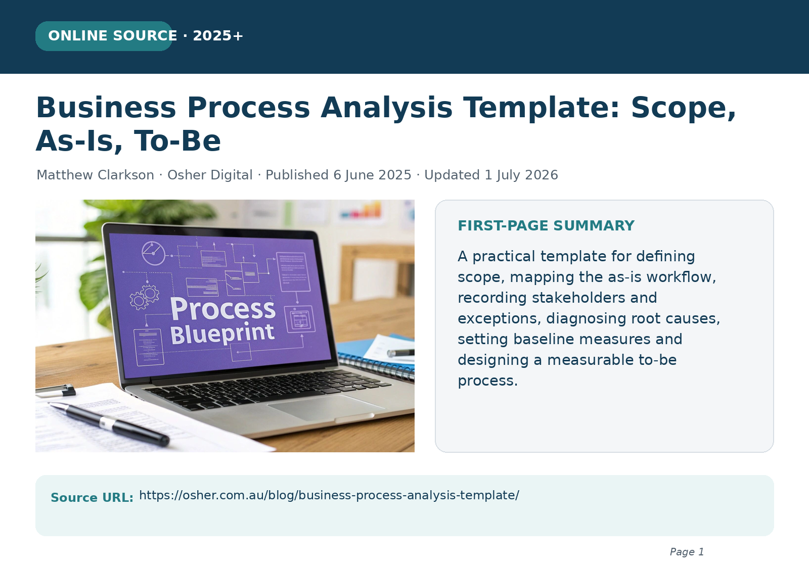
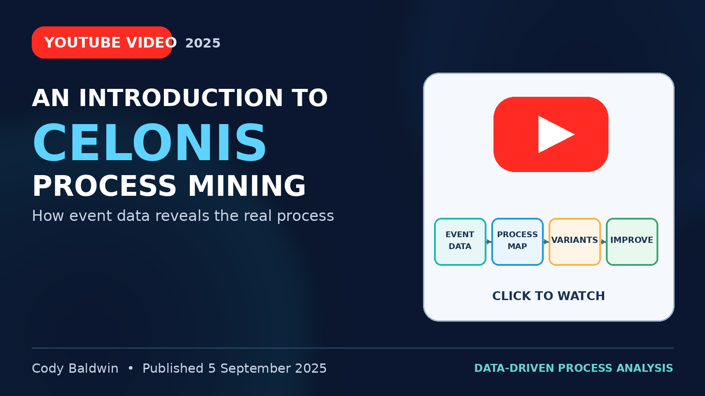
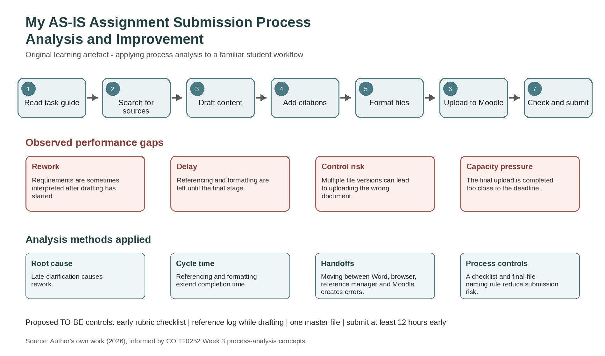

# COIT20252: Business Process Management

**HT2, 2026**

## Assessment 1 – ePortfolio 1

| Student details | Information |
|---|---|
| **Student name** | Binaya Bhandari |
| **Student number** | 12312847 |
| **Email** | Binaya.bhandari@cqumail.com |
| **Unit** | COIT20252: Business Process Management |
| **Tutor** | Shakir Karim |
| **Due date** | Friday, 07 Aug 2026 |

---

## Chosen Topic and Reason for Selection

I selected Process Analysis from Week 3 because it changed how I understand improvement work. Before studying this topic, I mainly viewed a process as a sequence of activities that could be mapped. I now understand that analysis requires evidence: defining scope, identifying performance gaps, diagnosing causes and selecting measures before recommending a to-be process. The four artefacts below demonstrate this development.

## Process-analysis methods from the Week 3 lecture

  

*Figure 1. Week 3 lecture slide presenting process-analysis methods (CQUniversity 2026, p. 30).*

**Summary:** Process analysis is broken down into cost, root cause, cycle time, sensitivity (what if), and risk analysis in the Week 3 lecture slide groups. It also links root cause investigation to the five whys, failure mode and effects analysis, fish bone diagrams and Pareto analysis. The main point of the message is to choose a method to fit the performance problem and not use one method in all scenarios (CQUniversity 2026, p. 30).

**Reflection and justification:** I have selected this artefact because it challenged my previous thoughts about process analysis largely about drawing a workflow. A map describes what is happening, analysis explains why it is happening, or why there are delays, variation or risks. The focus of week 3 is also on collecting evidence and documenting performance gaps and causes (CQUniversity 2026, p. 27, 32). For future BPM work, I would do a diagnosis, then make suggestions about how to improve.

## Scope, as-is and to-be analysis

  

*Figure 2. Saved first page of the online business process analysis article (Clarkson 2026, p. 1).*

**Summary:** The Osher Digital article offers a practical template, which starts with the trigger, outcome and scope of the process. It then identifies the stakeholders, workflow, exceptions, pain points, root causes and baseline measures and then creates the to-be process. Activities are assessed to decide if they should be eliminated, automated, augmented, reordered, simplified or retained (Clarkson 2026, p. 1).

**Reflection and justification:** I chose this artefact as it either expresses each of the BPM concepts in a broad sense or narrows it down to a question which might lead to a workshop analyzing the artefact. Cycle time, rework, transaction cost and exception rate are examples of measure baseline points for comparison. With this, I can prove with evidence and compare the to-be process to the as-is processed, and check if the to-be process is able to have better performance.

**Source:** [Osher Digital – Business Process Analysis Template](https://osher.com.au/blog/business-process-analysis-template/)

## Process mining with Celonis

  

*Figure 3. Saved thumbnail for the 2025 Celonis process-mining video (Baldwin 2025, p. 1).*

**Video:** “An Introduction to Celonis (Process Mining)” · Cody Baldwin · 5 September 2025 · [Watch on YouTube](https://www.youtube.com/watch?v=D1fBsFFJhVg)

**Summary:** The video explains that Celonis is a Process Mining platform that generates process maps from the data stored in organizations. It demonstrates how recorded execution paths will be able to reveal variants, bottlenecks and inconsistent behavior, which may not be evident in a documented procedure. Users can find out what really happened, not just through interviews, assumptions or by relying on recollections of employees (Baldwin 2025, p. 1).

**Reflection and justification:** I selected the video as I thought that it would be more tangible than a definition. It was useful to me to be able to relate the Week 3 concepts that bottlenecks, variation and information-system analysis are relevant to real process-event data (CQUniversity 2026, p. 22-23, 29). I also discovered that software won't solve the problem; there needs to be some interpretation, context and prioritization of issues by analysts. Technology, in this case, is not meant to take the place of professional judgement, it is meant to enhance it.

## My assignment submission process analysis

  

*Figure 4. Original as-is assignment-submission process analysis (author’s own work 2026).*

**Summary:** The process analysis I have written is for my own workflow for assignments, since I read the task guide to submit the assignment. It defines rework, delay, file-version risk and capacity pressure; and links these gaps with root-cause, cycle-time, handoff and process-control analysis. The proposed controls to-be include an early rubric checklist, a reference log, one master file and a submission 12 hours or more in advance of the deadline (author's own work 2026).

**Reflection and justification:** This artefact has been added as an example of application, not source summary. After analyzing a familiar process, I realized that if I had to wait until the end to clarify the process, it would be rework, if I had to wait until the end to reference it, it would take longer to cycle and if I had multiple files to reference, it would be less robust control. This exercise has affected my approach to practice: I can now clearly state a problem, find the cause and select a measurable control. Exhibits the way that BPM concepts can enhance personal workflows and organizational processes (CQUniversity 2026, pp. 21-26, 32).

## References

Baldwin, C 2025, ‘An Introduction to Celonis (Process Mining)’, YouTube video, 5 September, viewed 6 August 2026, <https://www.youtube.com/watch?v=D1fBsFFJhVg>.

Clarkson, M 2026, ‘Business Process Analysis Template: Scope, As-Is, To-Be’, Osher Digital, originally published 6 June 2025, updated 1 July 2026, viewed 6 August 2026, <https://osher.com.au/blog/business-process-analysis-template/>.

CQUniversity 2026, *COIT20252 Business Process Management: Week 3 – Process Analysis*, PowerPoint slides, CQUniversity, viewed 6 August 2026, Moodle.

> **Citation notes:** For the website and YouTube artefacts, “p. 1” refers to the saved first-page or thumbnail record displayed in this ePortfolio. All summaries, justifications and reflective statements are provided as editable document text rather than being embedded inside the images.

## AI use statement

Generative AI was used during the planning and editing stages to compare possible artefact categories, identify language issues and check the draft against the assessment task guide and marking rubric. I reviewed the original sources, verified their dates and relevance, and revised the reflective commentary so that the final submission represents my own understanding and professional judgement.
